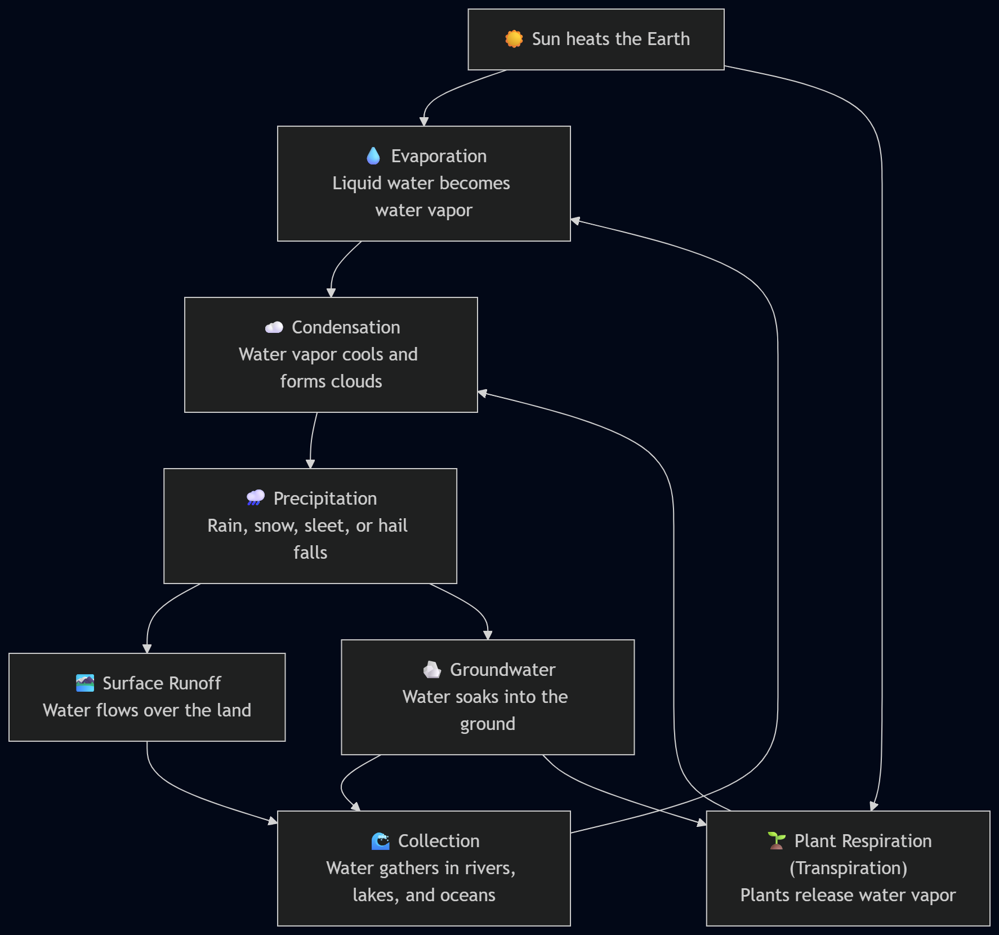

# Day five

## Prompting

- How to better create prompts

**What is prompt engineering**

- The process of guiding an AI to a solution and a desiered outcome.

** Your holding it wront**

- Prompt engineering is a powerful tool, but should not be used to excuse for AI flaws
- When critics point out issues, they often say "you're promting it wrong"

- Mention to Apples "Your holding it wrong" when the antena was at the bottom.

### Prompt Framework RCREI

**Task**

- Persona
- Format

**Context**

- ## Good:
- ## Bad:

**Reference**

- Provide additional data, examples, or specific ideas to guide the AI

**Evaluate**

- Review the output, does this meet the requirements?

**Iterate**

- Feed errors back in
- Add more detain or refine constratints

### Always be iterating

If results are lacking, always mark up your prompt with TCR
\*\*

- T: Makea schedule for the ream (Output: CSV)
- C: Specific details about individual schedules
- R: Past schedule templates

Seperate into shorter tasks

- Dont use Monolithic prompts.
- Break "Summarize and Graph" into two distinct steps.

### Refinement Strategies

- Try diffirent phrasing
  - Use an anologous task: instead of "write a marketing plan", try "Write a story about how this product fits intpo a customers life".
- Introduce constraints
  - "Only use music from Canada"
  - "Recipies that take less than 30 minutes"

## Demo - The power of context

### Prompt

````txt
You are a 5th-grade teacher and need to teach your students the water cycle. Make sure you include: precipitation, surface runoff, groundwater, respiration (plants), / Evaporation, and condensation.


Generate an age-appropriate diagram of the weather cycle using a Mermaid diagram.


Output the diagram in valid text that would generate a diagram so I can edit it.```
````

### Output

```mermade

flowchart TD
    A["☀️ Sun heats the Earth"] --> B["💧 Evaporation<br/>Liquid water becomes water vapor"]
    A --> C["🌱 Plant Respiration<br/>(Transpiration)<br/>Plants release water vapor"]

    B --> D["☁️ Condensation<br/>Water vapor cools and forms clouds"]
    C --> D

    D --> E["🌧️ Precipitation<br/>Rain, snow, sleet, or hail falls"]

    E --> F["🏞️ Surface Runoff<br/>Water flows over the land"]
    E --> G["🪨 Groundwater<br/>Water soaks into the ground"]

    F --> H["🌊 Collection<br/>Water gathers in rivers, lakes, and oceans"]
    G --> H

    H --> B
    G --> C
```


